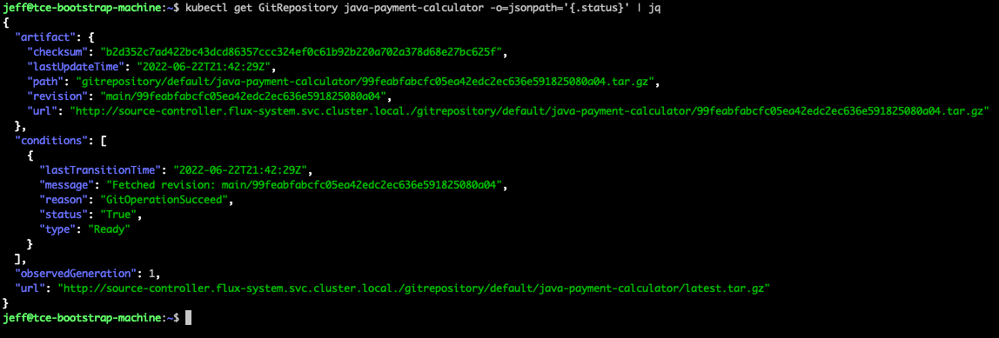
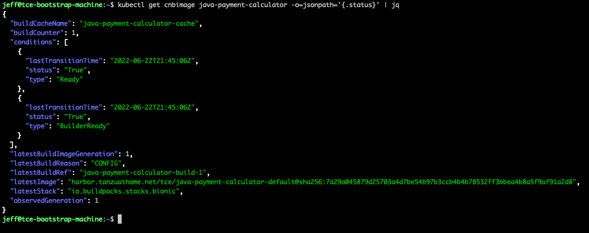

# Cartographer Deep Dive

Cartographer is an open source supply chain choreographer. That sentance may not make a lot of sense just yet, so we'll
dig into the details of how it works.

## Cartographer Basics

Some basic definitions:

| Term | Meaning |
|---|---|
| Template | A resource that can create (or "stamp out") other Kubernetes resources. Some templates have well defined output variables. |
| Supply Chain | A blueprint composed of one or more templates. Templates can be dependant on other templates and can access their output variables. This can define an order of execution that will be managed by the supply chain (somewhat similar to Terraform). |
| Workload | An instance of a supply chain |

When a workload is created, Cartographer uses the templates in the supply chain to "stamp out" the Kubernetes resources
defined by the templates. The supply chain will watch for each resource becoming ready, and in some cases will forward
the outputs of one resource to the next dependent resource in the supply chain. Once all stamped out resources become
ready, the supply chain is considered complete. If any resource in a supply chain changes, Cartographer will re-run the
dependant resources.

For example, suppose a resource is watching a Git Repository. The resource may self-mutate when a commit happens and change the value
of the output variables. Cartographer will, in turn, update the dependant resources with new values - whch may cause the
dependant resources to mutate and change their own output variables. This process repeats until the supply chain completely reconciles.

## About The "Out of the Box" Supply Chain

TCE ships with an "out of the box" supply chain named `source-to-url`. You can retrieve the definition of the supply chain
with this command:

```shell
kubectl describe ClusterSupplyChain source-to-url
```

The source code for the TCE supply chain is on GitHub here: https://github.com/vmware-tanzu/cartographer-catalog

The supply chain has three templates:

1. A `ClusterSourceTemplate` named `git-repository` that knows how to stamp out a Flux GitRepository resource that watches a git repo for source code changes
1. A `ClusterImageTemplate` named `image` that knows how to stamp out a Kpack Image resource that will build an image based on the current source code and push the image into a repository
1. A `ClusterTemplate` named `app` that knows how to stamp out resources that will run the image as a Knative service using Kapp

You can retrieve the defeinition of each of these resources using `kubectl`, or you can look at the source code on GitHub.

## Examining the Workload 

When we ran the `tanzu apps workload create...` command, we created a `workload` - which is an instance of a
`supply chain`. The workload, in turn, stamped out three resources in the cluster - one for each of the steps in the
supply chain. In addition, there is a workload resource that manages the interactions between the three other
resources. You can see these object using the "tree" plugin for kubectl:

```shell
kubectl tree workload java-payment-calculator
```

The output looks like this:


Here you see a Workload resource named "java-payment-calculator" that is the parent of three other resources:
an App, a GitRepository, and an Image. These correspond to the three parts of the supply chain. Notice
that the Image resource also has child resources - we'll ignore those for now. Also know that the App resource is a
Carvel Kapp definition for a Kubernetes application - the App also created several other resources that are not shown
in the tree output. For example, there is a Knative service in the cluster related to this workload - you can see it's
definition with this command:

```shell
kubectl describe ksvc java-payment-calculator
```

From the tree output you can know that there is something called a "workload" that knows about three other things.
In Cartographer, we say that the workload "choreographs" the interactions between those three other things.

## Examining the GitRepository Resource

The first thing to examine is the `GitRepository` resource. The out of the box supply chain uses the
[Flux Source Controller](https://fluxcd.io/docs/components/source/) to supply source code for a supply chain.
The source controller will download the source code from a Git repository and make it available in the cluster.
You can see the configuration of the controller with this command:

```shell
kubectl describe GitRepository java-payment-calculator
```

We'll look at the `spec` section with the following command:

```shell
kubectl get GitRepository java-payment-calculator -o=jsonpath='{.spec}' | jq
```

The output looks like this:


You will see two configuration items that we supplied on the workload command: the Git URL and the branch.
There are other parts of the configuration such as the Git implementation and the timeout that came from 
somewhere else. Those items came from the `ClusterSourceTemplate`. This illustrates a key concept in Cartographer:
resources are built (or "stamped out") from templates, and templates can receive input values from different sources.

Now let's look at the `status` section (all Kubernetes resources expose a status object)

```shell
kubectl get GitRepository java-payment-calculator -o=jsonpath='{.status}' | jq
```

The output looks like this:



There are two important items in this output: `status.artifact.url` and `status.artifact.revision`. The URL
is a cluster internal URL where the source code is available and the revision is the Git SHA related to the source code.
The `ClusterSourceTemplate` is configured to read these two values and make them availble to other parts of the supply
chain.

## Examining the Image Resource

The next thing to examine is the `Image` resource. The out of the box supply chain uses the
[Kpack Image](https://github.com/pivotal/kpack/blob/main/docs/image.md) to build images from source and publish
them to a repository. Note that Kpack uses [Cloud Native Buildpacks](https://buildpacks.io) to build images.
The Image resource will build an image, publish it to a repo, and make the resulting image tag in it's status.
You can see the configuration of the Image with this command:

```shell
kubectl describe cnbimage java-payment-calculator
```

We'll look at part of the `spec` section with the following command:

```shell
kubectl get cnbimage java-payment-calculator -o=jsonpath='{.spec.source}' | jq
```

The output looks like this:


You will see something familiar - the source URL matches the output of the Flux GitRepository above! How did that happen?
This is Cartographer in action - Cartographer took the output of the GitRepository resource and modified the Image resource
with the value.

Now let's look at the `status` section:

```shell
kubectl get cnbimage java-payment-calculator -o=jsonpath='{.status}' | jq
```

The output looks like this:



There is one very important item in this output: `status.latestImage`. This is the tag if the image created by Kpack that
matches the source code revision. The `ClusterImageTemplate` is configured to read this value and make it availble to
other parts of the supply chain.

## Examining the App Resource

The next thing to examine is the `App` resource. The out of the box supply chain uses the
[Carvel Kapp Controller](https://carvel.dev/kapp-controller/) to deploy an application. The Kapp application, in turn,
uses Knative. This second level of abstraction is used because the raw Knative resource can not be mutated as 
flexibly as a Kapp application. You can see the configuration of the application with this command:

```shell
kubectl describe App java-payment-calculator
```

Use of the Kapp controller is beyond the scope of this workshop so we won't delve into this very
much. Suffice to say that Kapp creates a Knative service named `java-payment-calculator` that we can recognize.
You can see the service definition in the App resource with this command:

```shell
kubectl get App java-payment-calculator -o=jsonpath="{.spec.fetch[0].inline.paths['service\.yml']}"
```

With that command you can see the YAML that Kapp uses to create the Knative service. Let's look
at a part of the Knative service's `spec` section:

```shell
kubectl get kservice java-payment-calculator -o=jsonpath="{.spec.template.spec.containers[0]}" | jq
```

The output looks like this:


Again you will see that Cartographer has been at work. The image spec in this resource definition matches the output from
the Kpack Image resource. This is the last step in the supply chain. We can use the Knative CLI to see details about the service:

```shell
kn service describe java-payment-calculator
```

The output looks like this:


From this output you can find the generated URL of the service. I executed these commands on a managed cluster with a
load balancer and a real domain name, so my service is available at http://java-payment-calculator.default.tce.tanzuathome.net

## Examining the Supply Chain

We have seen how the individual templates in the supply chain stamp out Kubernetes resources and how Cartographer can
understand dependencies between the templates and forward values from one resource to another. Let's look at
the supply chain definition

https://github.com/vmware-tanzu/cartographer-catalog/blob/de7af88643cc432739b28b758b56398345d038cf/src/supply-chains/source-to-url/supply-chain.yaml#L22-L62


